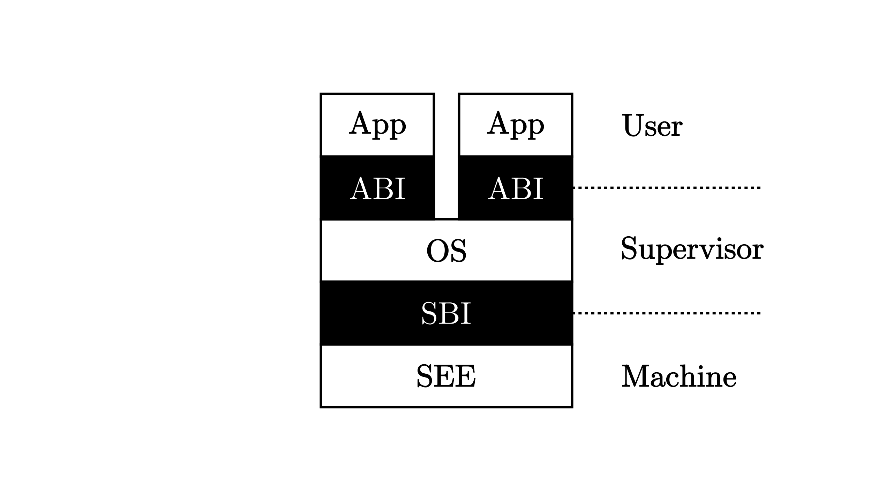
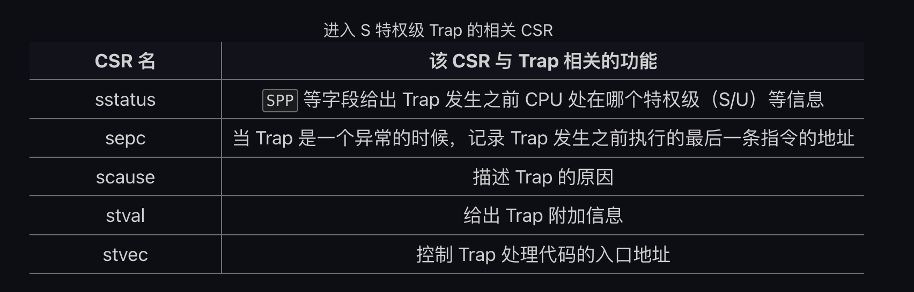
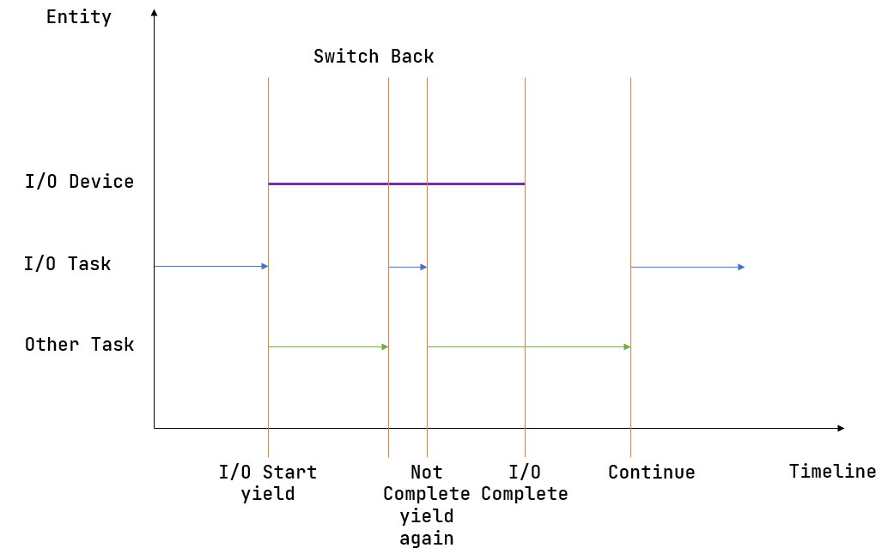

# TOC:
<!--toc:start-->
- [TOC:](#toc)
- [Notes taken through my journey of learning to write an OS in Rust](#notes-taken-through-my-journey-of-learning-to-write-an-os-in-rust)
  - [References](#references)
    - [RISC-V](#risc-v)
      - [Cheetsheet](#cheetsheet)
    - [utils](#utils)
  - [Journal](#journal)
    - [Day 1](#day-1)
      - [Rustlings(Offcial repo)](#rustlingsoffcial-repo)
      - [LearningOS/rustlings-100exercises(OS camp 100 exercises)](#learningosrustlings-100exercisesos-camp-100-exercises)
    - [Day 2](#day-2)
      - [chapter 0](#chapter-0)
        - [Environment setup](#environment-setup)
    - [Day 3](#day-3)
      - [Chapter 1 三叶虫LibOS](#chapter-1-三叶虫libos)
        - [应用程序执行环境](#应用程序执行环境)
        - [移除标准库依赖](#移除标准库依赖)
        - [内核第一条指令](#内核第一条指令)
        - [编写内核第一条指令](#编写内核第一条指令)
        - [GDB验证启动流程](#gdb验证启动流程)
      - [RISC-V Instruction Set Explanation](#risc-v-instruction-set-explanation)
      - [为内核支持函数调用](#为内核支持函数调用)
        - [函数调用与栈](#函数调用与栈)
      - [基于SBI服务完成输出和关机](#基于sbi服务完成输出和关机)
    - [Day 4](#day-4)
      - [Chapter 2 邓式鱼BatchOS](#chapter-2-邓式鱼batchos)
        - [特权级机制](#特权级机制)
          - [RISC-V 特权级架构](#risc-v-特权级架构)
        - [实现应用程序](#实现应用程序)
        - [实现批处理操作系统](#实现批处理操作系统)
        - [实现特权级的切换](#实现特权级的切换)
          - [特权级切换的起因](#特权级切换的起因)
          - [Trap管理](#trap管理)
    - [Day 5](#day-5)
      - [Chapter 3 三叠纪CoopOS](#chapter-3-三叠纪coopos)
        - [多道程序与分时多任务](#多道程序与分时多任务)
          - [多道程序放置 锯齿螈OS](#多道程序放置-锯齿螈os)
          - [任务切换 始初龙OS](#任务切换-始初龙os)
          - [多道程序与协作式调度](#多道程序与协作式调度)
          - [分时多任务系统与抢占式调度 腔骨龙OS](#分时多任务系统与抢占式调度-腔骨龙os)
<!--toc:end-->

# Notes taken through my journey of learning to write an OS in Rust

## References

- [rCore-Tutorial-Book-v3](https://rcore-os.cn/rCore-Tutorial-Book-v3/chapter0/index.html)

- 2023 A
    - [rCore 2023(Autumn) overview](https://github.com/LearningOS/rust-based-os-comp2023)
    - [rCore-Tutorial-Guide 2023(Autumn)](https://learningos.cn/rCore-Tutorial-Guide-2023A)
    - [第一阶段线上课](https://os2edu.cn/course/123)
    - [第二阶段rCore Classroom链接](https://classroom.github.com/a/QCd3t3jG)
        - [我的作业](https://github.com/LearningOS/2023a-rcore-ye-junzhe)
            1. update rustsbi-qemu.bin
            2. git clone https://github.com/LearningOS/rCore-Tutorial-Test-2023A.git user
            3. Comment out "env:"(rustup something something) in makefile, both in os/ and ci-user/, otherwise it'll destroy your Rust env
            4. git clone https://github.com/LearningOS/rCore-Tutorial-Checker-2023A.git ci-user
            5. git clone https://github.com/LearningOS/rCore-Tutorial-Test-2023A.git ci-user/user
            6. Add reports at root dir
            7. cd ci-user && make test CHAPTER=$ID
    - [第二阶段基于Rust语言的rCore Tutorial排行榜](https://os2edu.cn/2023-autumn-os-ranking)

- ~2023 S~
    - ~[rCore 2023(Spring) overview](https://github.com/LearningOS/rCore-Tutorial-Code-2023S)~
    - ~[rCore-Tutorial-Guide 2023(Spring)](https://learningos.github.io/rCore-Tutorial-Guide-2023S/index.html)~

### RISC-V

- [Computer Organization and Design RISC-V Edition: The Hardware Software Interface - David A. Patterson](https://zlibrary-redirect.se/book/17022047/e06bf8/?)
- [The RISC-V Reader: An Open Architecture Atlas](http://www.riscvbook.com)
    - [The RISC-V Reader 中文版](http://riscvbook.com/chinese/RISC-V-Reader-Chinese-v2p1.pdf)
    - [RISC-V Green Card](http://www.riscvbook.com/greencard-20181213.pdf)
- [riscv-asm-manual on Github](https://github.com/riscv-non-isa/riscv-asm-manual)
- [【计算机架构的伟大想法】UC Berkeley 公开课-CS61C (Fall 2021)](https://www.bilibili.com/video/BV1Lu411X7u7/?p=6&spm_id_from=333.788.top_right_bar_window_history.content.click)

#### Cheetsheet
- [RISC-V Linux syscall table](https://jborza.com/post/2021-05-11-riscv-linux-syscalls)
- [RISC-V SBI specification](https://lkml.iu.edu/hypermail/linux/kernel/2201.1/02422/RISC-V_SBI_specifcation.pdf)


### utils

- [RISC-V tools](https://github.com/sifive/freedom-tools)
- [cargo-binutils](https://github.com/rust-embedded/cargo-binutils) 

## Journal

### Day 1

#### Rustlings(Offcial repo)

- <https://github.com/ye-junzhe/rustlings_solutions>

#### LearningOS/rustlings-100exercises(OS camp 100 exercises)

- <https://github.com/LearningOS/rust-rustlings-2023-autumn-ye-junzhe>

### Day 2

#### chapter 0

##### Environment setup

Successfully setup the developing environment following the guidelines [here](https://rcore-os.cn/rCore-Tutorial-Book-v3/chapter0/5setup-devel-env.html)

- rCore locked the Rust toolchain version inside the repo in [.cargo](./rCore-Tutorial-v3/os/.cargo/config), didn't know that trick
- Be Ware: Whoever is on a arm64 machine, after downloading the [RISC-V tools](https://github.com/sifive/freedom-tools), use **riscv64-unknown-elf-gdb-py** instead of **riscv64-unknown-elf-gdb**, due to the need of python support needed by [gdb-dashboard](https://github.com/cyrus-and/gdb-dashboard). Otherwise we'll get an error: "Scripting in the "Python" language is not supported in this copy of GDB". But there is a build in TUI inside GDB anyway, so, not really that of a big deal maybe? Just call 'tui enable' when debugging in GDB

### Day 3

#### Chapter 1 三叶虫LibOS

##### 应用程序执行环境

      ```
          应用程序
            ||
            || 函数调用
            ||
            \/
          标准库
            ||
            || 系统调用
            ||
            \/
        内核/操作系统
            ||
            ||  指令集
            ||
            \/
          硬件平台
      ```

##### 移除标准库依赖

- #![no_std]
- #[panic_handler]

```rust
use core::panic::PanicInfo;
fn panic(_info: &PanicInfo) -> ! {
    loop{}
}
```

- #![no_main]
- [cargo-binutils](https://github.com/rust-embedded/cargo-binutils) 
    - rust-readobj 文件头信息
    - rust-objdump 反汇编

##### 内核第一条指令

- QEMU 模拟加电启动
    
    1. Stage 1
        - QEMU PC(Program Counter) => 初始化0x1000 => 0x80000000
    2. Stage 2
        - 0x80000000 bootloader(rustsbi-qemu.bin) => 0x80200000
    3. Stage 3
        - 0x80200000 os.bin

- 程序内存布局

    1. 典型布局

        - High Address
            - stack
            - heap
            - .bss(保存未初始化的全局数据)
            - .data
            - .rodata
            - .text
        - Low Address

    2. Linker
        - 不同目标文件的段的重新排布

            

        - 将符号替换为具体地址
            - 内部符号
            - Symbol table => 获取外部符号
            - 合并，地址发生变化 => Relocation

##### 编写内核第一条指令

```bash
qemu-system-riscv64 \
    -machine virt \
    -nographic \
    -bios ../bootloader/rustsbi-qemu.bin \ # bootloader
    -device loader,file=target/riscv64gc-unknown-none-elf/release/os.bin,addr=0x80200000
```

- [entry.asm](https://rcore-os.cn/rCore-Tutorial-Book-v3/chapter1/4first-instruction-in-kernel2.html#:~:text=%23%20os%2Fsrc%2Fentry.asm)

```asm
# RISC-V
    .section .text.entry    # .section => Code Section, .text.entry => Name of the Code Section
    .global _start          # Global variable _start
_start:                     # Pointing to the line after it
    li x1, 100              # li => Load Immediate,
                            # x1 => x1 reg,
                            # 100 => value
```

```rust
// Rust
use core::arch::global_asm
global_asm!(include_str!("entry.asm"));
```

- [Linker Script](https://rcore-os.cn/rCore-Tutorial-Book-v3/chapter1/4first-instruction-in-kernel2.html#:~:text=os%2Fsrc%2Flinker.ld)
To manually set the first line of the OS's instruction at 0x80200000, fitting QEMU's expectation
    - OUTPUT_ARCH() => Target Architecture
    - ENTRY() => Entry Point of the OS
    - SECTIONS => Sections
    - . => Current Address

- Strip Metadata -- otherwise QEMU will not find kernel's first instruction at BASE_ADDR


```bash
rust-objcopy
    --strip-all os(The os executable)
    -O binary os.bin(The binary after stripped)
```
strip 之后的os.bin仅 4 字节，这是因为它里面仅包含我们在 `entry.asm` 中编写的一条指令。一般情况下 RISC-V 架构的一条指令位宽即为 4 字节。
> QEMU > 7.0.0 不必进行任何元数据的裁剪工作-device loader,file=path/to/os，即教程中使用的

##### GDB验证启动流程

```bash
qemu-system-riscv64 \
... \
-s -S # -s => Start server, -S => Start running when a request is received
```

```bash
(gdb) x/10i $pc => 从PC开始，展示10条反汇编
0x1000:     auipc   t0,0x0
0x1004:     addi    a1,t0,32
0x1008:     csrr    a0,mhartid
0x100c:     ld      t0,24(t0)       => The value of t0 is 0x80000000
0x1010:     jr      t0
0x1014:     unimp
0x1016:     unimp
0x1018:     unimp
0x101a:     0x8000
0x101c:     unimp
```

- 单步调试
```bash
(gdb) si
0x0000000000001004 in ?? ()
(gdb) si
0x0000000000001008 in ?? ()
(gdb) si
0x000000000000100c in ?? ()
(gdb) si
0x0000000000001010 in ?? ()
(gdb) p/x $t0               => 以 16 进制打印寄存器 t0 的值
1 = 0x80000000              => 可以看到是0x80000000
(gdb) si
0x0000000080000000 in ?? () => 程序进入了0x80000000，即将进入RustSBI
```

- 进入RustSBI
```bash
(gdb) x/10i $pc     => 10 lines of assemblly code
0x80000000:         auipc   sp,0x28
0x80000004: mv      sp,sp
0x80000008: lui     t0,0x4
0x8000000a: addi    t1,a0,1
0x8000000e: add     sp,sp,t0
0x80000010: addi    t1,t1,-1
0x80000012: bnez    t1,0x8000000e
0x80000016: j       0x8001125a
0x8000001a: unimp
0x8000001c: addi    sp,sp,-48
(gdb) si
0x0000000080000004 in ?? ()
(gdb) si
0x0000000080000008 in ?? ()
(gdb) si
0x000000008000000a in ?? ()
(gdb) si
0x000000008000000e in ?? ()
```

- 在内核入口设置断点
```bash
(gdb) b *0x80200000         => 如果在特定地址设置断点需加*
Breakpoint 1 at 0x80200000
(gdb) c
Continuing.

Breakpoint 1, 0x0000000080200000 in ?? ()
```

- 进入内核
```bash
(gdb) x/5i $pc
0x80200000: li ra,100    => 即entry.asm中的第一条指令(ra即x1寄存器)
0x80200004: unimp
0x80200006: unimp
0x80200008: unimp
0x8020000a: unimp
(gdb) si
0x0000000080200004 in ?? ()
(gdb) p/d $x1           => Print/Decimal $x1
2 = 100
(gdb) p/x $sp           => 栈指针(Stack Pointer)
3 = 0x0                 => 为0
```

> Since I can't understand the RISC-V asm above. I think maybe it's about time to Read the RISC-V manuel(There's a ton of RISC-V books holy...).

#### RISC-V Instruction Set Explanation
Found this article on the Internet, which described RISC-V Instruction Set so well

- <https://fraserinnovations.com/risc-v/risc-v-instruction-set-explanation/>
    - The **immediate** is the number that exists as an integer in the instructions.
    - So basically every instruction does this kind of thing
        1. Specify the instruction type
        2. Set the rd(Destination Register) (except for type S/B)
        3. Read rs1 & rs2(Source Register)  (except for type U/I/J)
        4. Perform operations
        5. Write the result to rd or some register


    - And there are many instructions for each instruction type
            RV32I can be divided into six basic instruction formats:

        

        - R-type instructions for register-register operations
        - I-type instructions for immediate and load operations
        - S-type instructions for store operations
        - B-type instructions for conditional branch operations
        - U-type instructions for long immediate
        - J-type instructions for unconditional jumps.

#### 为内核支持函数调用

##### 函数调用与栈

- Function Call Context


- [JAL and JALR explain(和rCore的JALR不同，暂时按照greencard，或许只是两种写法，但意义相同)](https://fraserinnovations.com/risc-v/risc-v-instruction-set-explanation/#:~:text=question%3A%20why%20does%20the%20pc%20add%204%3F)

So basically they are J-Type instructions:
1. JAL rd, imm[20:1] => Jump to imm[20:1]
2. JALR rd, rs1, imm[11:0] => Jump back to rs1

For example: jal x1, 80000040:
- rd == x1 is where the PC is pointing
- x1 = rd + 4, stores the adress for jumping back
- rs1 = x1, expand imm to x1 is exists
- Then the program jumps back to rs1

> rs => Source Register (可在x0-x31通用寄存器选取), imm => Immediate, rd => Destination Register (可在x0-x31通用寄存器选取)

- 调用规范(Calling Convention)

    - Stack Frame

        - ra => Return address  callee saved
        - 父栈帧的结束地址 fp   callee saved
        - s1 ~ s11              callee saved
        - 函数所使用到的局部变量。
        

    - 分配并使用启动栈
        1. Allocate stack frame
        2. Initialize .bss

#### 基于SBI服务完成输出和关机

- 使用 RustSBI 提供的服务
    - fn [sbi_call](https://rcore-os.cn/rCore-Tutorial-Book-v3/chapter1/6print-and-shutdown-based-on-sbi.html#rustsbi)
    - 封装一些RustSBI服务:
        - SBI_CONSOLE_PUTCHAR
        - SBI_SHUTDOWN
- 实现格式化输出
    - impl Write for Stdout
    - declare print & println macro
- 处理致命错误
    - panic => shutdown()

### Day 4

#### Chapter 2 邓式鱼BatchOS

> BatchOS => Load one app to APP_BASE_ADDR

##### 特权级机制

- ecall(Excution Environment Call)      切换至比当前高一级的特权级
- eret(Excution Environment Return)     切换至不高于当前的特权级

###### RISC-V 特权级架构

- User          用户模式        
- Supervisor    监督模式        => OS
- Hypervisor    虚拟监督模式    
- Machine       机器模式        => SEE, Supervisor Execution Environment

In the perspective of privileged architecture



- Exception

RISC-V Exceptions - https://rcore-os.cn/rCore-Tutorial-Book-v3/chapter2/1rv-privilege.html#id6

- Trap/trap instructions, caused by specific calls

    - Breakpoint
    - Environment call

结果：陷入异常控制流

##### 实现应用程序

- 程序的起始物理地址调整为 0x80400000 ，三个应用程序都会被加载到这个物理地址上运行；
- 将 _start 所在的 .text.entry 放在整个程序的开头，作为用户库的入口点，并会在初始化之后跳转到应用程序主逻辑；
- 提供最终可执行文件 .bss 段起始、终止地址，供 clear_bss 函数使用

[第二章新增系统调用](https://rcore-os.cn/rCore-Tutorial-Book-v3/chapter2/2application.html#id10)
```rust
/// 功能：将内存中缓冲区中的数据写入文件。
/// 参数：`fd` 表示待写入文件的文件描述符；
///      `buf` 表示内存中缓冲区的起始地址；
///      `len` 表示内存中缓冲区的长度。
/// 返回值：返回成功写入的长度。
/// syscall ID：64
fn sys_write(fd: usize, buf: *const u8, len: usize) -> isize;

/// 功能：退出应用程序并将返回值告知批处理系统。
/// 参数：`exit_code` 表示应用程序的返回值。
/// 返回值：该系统调用不应该返回。
/// syscall ID：93
fn sys_exit(exit_code: usize) -> !;
```
- RISC-V Register-ABI Names-Descriptions


> Bind args to regs

```rust
// NOTE: syscall
// user/src/syscall.rs
use core::arch::asm;
// user/src/syscall.rs
// - Rust Inline ASM: https://rust-lang.github.io/rfcs/2873-inline-asm.html
fn syscall(id: usize, args: [usize; 3]) -> isize {
    let mut ret: isize;
    unsafe {
        asm!(
            "ecall",
            // x10 => 保存系统调用的返回值(同时也作为输入)
            inlateout("x10") args[0] => ret,    => a0
            // 输入参数args、变量id
            in("x11") args[1],                  => a1
            in("x12") args[2],                  => a2
            in("x17") id                        => a7
        );
    }
    ret
}
```
##### 实现批处理操作系统

应用放置静态绑定
操作系统加载应用动态加载

内核中的应用程序的数量和相应位置，供运行时加载和管理

- [link_app.S](https://rcore-os.cn/rCore-Tutorial-Book-v3/chapter2/3batch-system.html#id3)

> 这个文件是在 cargo build 的时候，由脚本 os/build.rs 控制生成的

- 全局AppManager & UpSafeCell保证“单线程”安全

> Rust 对于并发安全的检查较为粗糙，当声明一个全局变量的时候，编译器会默认程序员会在多线程上使用它

```rust
// os/src/sync/up.rs
pub struct UPSafeCell<T> {
    /// inner data
    inner: RefCell<T>,
}
unsafe impl<T> Sync for UPSafeCell<T> {}
impl<T> UPSafeCell<T> {
    /// User is responsible to guarantee that inner struct is only used in
    /// uniprocessor.
    pub unsafe fn new(value: T) -> Self {
        Self { inner: RefCell::new(value) }
    }
    /// Panic if the data has been borrowed.
    pub fn exclusive_access(&self) -> RefMut<'_, T> {
        self.inner.borrow_mut()
    }
}
```
1. 初始化AppManager

[read_volatile()](https://doc.rust-lang.org/std/ptr/fn.read_volatile.html#:~:text=%3A%3Aptr%3A%3A-,read_volatile,-1.9.0%20%C2%B7%20source)

```rust
// lazy_static => Initialize AppManager at runtime(依赖于运行期间才能得到的数据)
lazy_static! {
    ...
}
```

2. load_app

将参数**app_id**对应的**应用程序**的**二进制镜像**加载到物理内存以*0x80400000*起始的位置
即将app的内容复制到APP_BASE_ADDRESS

```rust
unsafe fn load_app(&self, app_id: usize) {
    ...
}
```

##### 实现特权级的切换

> Trap 前的特权级不会高于 Trap 后的特权级

###### 特权级切换的起因
当启动应用程序的时候，需要初始化应用程序的用户态上下文，并能切换到用户态执行应用程序；
当应用程序发起系统调用（即发出 Trap）之后，需要到批处理操作系统中进行处理；
执行出错，OS kill app & run_next_app
执行结束，run_next_app

- 控制状态寄存器 (CSR, Control and Status Register) => 辅助 Trap 处理

- RISC-V-Reader-Chinese P108
⚫ 发生**例外的指令的PC被存入sepc，且PC被设置为stvec**。
⚫ scause按图10.3根据异常类型设置，**stval被设置成出错的地址**或者其它特定异常的信息字。
⚫ 把sstatusCSR中的SIE置零，屏蔽中断，且SIE之前的值被保存在SPIE中。
⚫ 发生例外时的权限模式被保存在sstatus的SPP域，然后设置当前模式为S模式。



- 用户栈与内核栈

    - 专门为OS准备的**内核栈**来保存原控制流的寄存器状态
    - Trap 触发 CPU 会切换到 S 特权级并跳转至 stvec 所指的位置，


```rust
impl UserStack {
    fn get_sp(&self) -> usize {
        self.data.as_ptr() as usize + USER_STACK_SIZE
    }
}
```

> 换栈：sp 寄存器的值修改为 get_sp 的返回值

- Trap Context

包含所有通用寄存器x0-x31，另有sstatus和sepc

```rust
#[repr(C)]
pub struct TrapContext {
    pub x: [usize; 32],
    pub sstatus: Sstatus,
    pub sepc: usize,
}
```

###### Trap管理

- 修改 stvec 寄存器来指向正确的 Trap 出现地址
- stvec设置为Direct模式
- [保存&恢复Trap上下文-trap.S](https://rcore-os.cn/rCore-Tutorial-Book-v3/chapter2/4trap-handling.html#:~:text=Trap%20%E4%B8%8A%E4%B8%8B%E6%96%87%E7%9A%84-,__alltraps,-%E7%9A%84%E5%AE%9E%E7%8E%B0%EF%BC%9A)
    csrrw => CSR Read and Write
- csrrw sp sscratch sp => Switch between UserStack and KernelStack

```rust
// os/src/trap/mod.rs

global_asm!(include_str!("trap.S"));

pub fn init() {
    extern "C" { fn __alltraps(); }
    unsafe {
        stvec::write(__alltraps as usize, TrapMode::Direct);
    }
}
```

####### Trap 分发与处理

```rust
// os/src/trap/mod.rs

#[no_mangle]
pub fn trap_handler(cx: &mut TrapContext) -> &mut TrapContext {
    let scause = scause::read();
    let stval = stval::read();
    match scause.cause() {
        Trap::Exception(Exception::UserEnvCall) => {
            cx.sepc += 4;
            cx.x[10] = syscall(cx.x[17], [cx.x[10], cx.x[11], cx.x[12]]) as usize;
        }
        Trap::Exception(Exception::StoreFault) |
        Trap::Exception(Exception::StorePageFault) => {
            println!("[kernel] PageFault in application, kernel killed it.");
            run_next_app();
        }
        Trap::Exception(Exception::IllegalInstruction) => {
            println!("[kernel] IllegalInstruction in application, kernel killed it.");
            run_next_app();
        }
        _ => {
            panic!("Unsupported trap {:?}, stval = {:#x}!", scause.cause(), stval);
        }
    }
    cx
}
```

### Day 5

#### Chapter 3 三叠纪CoopOS

> CoopOS => Load every app at once

##### 多道程序与分时多任务

###### 多道程序放置 锯齿螈OS

***loader*** Module => Process Control
***task***   Module => Process Execute & Switch

1. build.py => Determine the address to load each app 
2. os/src/loader.rs => Load every app at once
- fn get_num_app => get total num of apps
- fn get_base_i => get base address of app i
3. ***config*** Module => All the constants

###### 任务切换 始初龙OS

- Task Context

```rust
// os/src/task/context.rs
pub struct TaskContext {
    ra: usize,
    sp: usize,
    s: [usize; 12],
}
```
[__switch(current_task_cx_ptr,  next_task_cx_ptr)](https://rcore-os.cn/rCore-Tutorial-Book-v3/chapter3/2task-switching.html#:~:text=%E4%B8%8B%E9%9D%A2%E6%88%91%E4%BB%AC%E7%BB%99%E5%87%BA-,__switch,-%E7%9A%84%E5%AE%9E%E7%8E%B0%EF%BC%9A)

    - .rept => repeat
    - sd sp, 8(a0) => store Doubleword, sp at the address of a0+8
    - sd ra. 0(a0) => store Doubleword, ra with a0(current_task_cx_ptr)
    - ld ra, 0(a1) => load Doubleword, ra with a1(next_task_cx_ptr)

###### 多道程序与协作式调度



- Task Status

    - UnInit
    - Ready
    - Running
    - Exited

- Task Control Block
    
```rust
// os/src/task/task.rs
#[derive(Copy, Clone)]
pub struct TaskControlBlock {
    pub task_status: TaskStatus,
    pub task_cx: TaskContext,
}
```

- TaskManager & TaskManagerInner

```rust
// os/src/task/mod.rs

pub struct TaskManager {
    num_app: usize,
    inner: UPSafeCell<TaskManagerInner>,
}

struct TaskManagerInner {
    tasks: [TaskControlBlock; MAX_APP_NUM],
    current_task: usize,
}
```

- Task-related Syscalls (**sys_yield**, sys_exit)

> yield apps that for example need IO, which can't be finished at once

- os/src/syscall/process.rs 
    - sys_yield (syscall ID: 124) now has to suspend_current_and_run_next()
    - sys_exit(exit_code) now has to exit_current_and_run_next()

- TaskManager-related functions

    - Status-related(os/src/task/mod.rs)
        - impl TaskManager { mark_current_suspended(&self) }
        - impl TaskManager { mark_current_exited(&self) }
    - next_task_?()
        - impl TaskManager { run_next_task() }
            - drop(inner) before __switch
        - impl TaskManager { find_next_task() -> Option<usize> }
            - find **first** task after current_task that is at the status of **Ready** 

    - __restore apps that enter U mode for the **first time** do not have TaskContext with them, we need to init for them
        - init_app_cx(app_id: usize) -> usize
            - Init **TrapContext** for tasks[i], and **push** the TrapContext to **KERNEL_STACK**
        - impl TaskContext { goto_restore(kstack_ptr: usize) -> Self }
        - iterate through **tasks**, adjust their states to **ready**

    - impl TaskManager { run_first_task() }
        - _unused TaskContext, to prevent coverting other data

###### 分时多任务系统与抢占式调度 腔骨龙OS

- Using RR(Round-Robin) algorithm to handle cooperaions between tasks

- RISC-V Interrupt(It's **Async** compare to Trap)

| Interrupt    | Exception    | Description    |
|---------------- | --------------- | --------------- |
| 1   | 1   | Supervisor Software Interrupt    |
| 1   | 3   | Machine Software Interrupt       |
| 1   | 5   | Supervisor Timer Interrupt       |
| 1   | 7   | Machine Timer Interrupt          |
| 1   | 9   | Supervisor External Interrupt    |
| 1   | 11  | Machine External Interrupt       |

Software Interrupt => Triggered by Software
Timer Interrupt => Triggered by Timer
External Interrupt => Triggered by External

- Interruption handle

sstatus(CSR reg).sie {
    ssie
    stie
    seie
}

```rust
if (sie == 1 && CPU Mode Not higher than S) && (ssie == 1 || stie ==1 || seie == 1)
    Handle the interruption {
        // To prevent nested Trap loops
        sstatus.spie = sstatus.sie;
        sstatus.sie = 0;
    }
    After interruption was handled {
        sret to where it's interrupted
        sstatus.sie = sstatus.spie;
}
else 
    Block the interruption
```

- Timer interrupt & RISC-V M Mode 64bit CSR mtime & mtimecmp

    - os/src/timer.rs
    - Once mtime > mtimecmp => Timer interrupt
        - SBI_SET_TIMER = 0 (According to SBI specification)
        - CLOCK_FREQ (How many clock **cycles** in 1 second, vary from platforms)
        - TICKS_PER_SEC = 100 **(100/1000s == 10ms)**
        - **Clock increment value** = **get_time() + CLOCK_FREQ / TICKS_PER_SEC**
            - == Every 10ms
        - Trigger timer interrupt at every **Clock increment value**
        - struct TimeVal (syscall ID: 169)
            - holding sec & usec

- Preemptive multitasking

    - rust_main(os/src/main.rs)
    To prevent S Mode Timer interrupt from being blocked
        - trap::enable_timer_interrupt()
        - timter::set_next_trigger

    - user/src/bin/03sleep.rs
